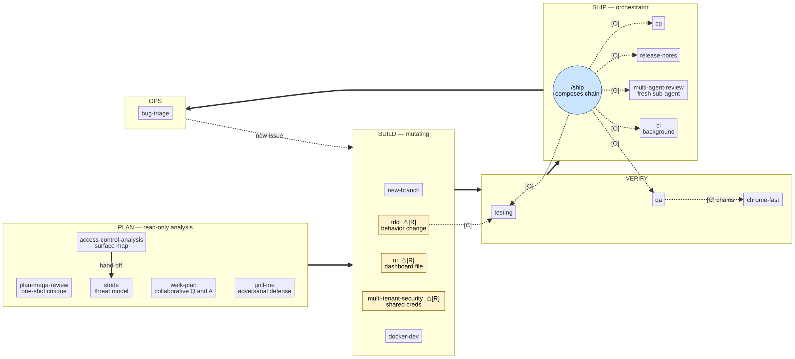
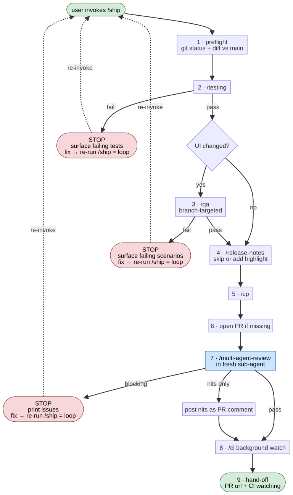
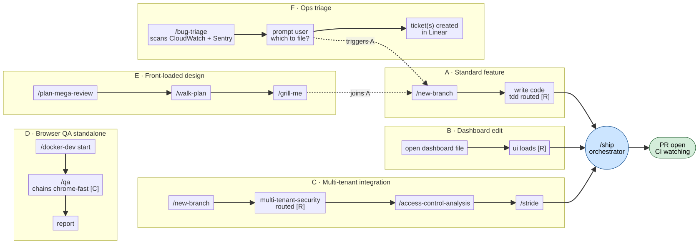

# Dino's skill stacking system

How Dino's Claude Code skills compose. Personal skills live in `~/.claude/skills/`, project skills in `./.claude/skills/`. The harness merges them at runtime; they're indistinguishable to the model.

**Read for the patterns, not for copying.** This is one engineer's stack on one codebase; your kit will look different. The four composition mechanisms this page names are the move. The specific skills (and the Dino-specific names: `Arctic Deep`, `bronto/MAP.md`, `src/analytics-dashboard/`) are how Dino instantiates the mechanisms against his own work. Read for the shape, then map your own.

---

## TL;DR

Skills are single-purpose named procedures. Composition mechanisms stitch them into workflows: **explicit load**, **orchestrator sequencing** (`/ship`), **routing dispatch** (CLAUDE.md predicates), and **hand-off pipelines**. The system has a clear shape: read-only analysis clusters at the front of the lifecycle, mutating skills cluster in the middle, ops loops back to build. `/ship` is the spine: it absorbs the closing commands of every workflow (`/cp`, `/release-notes`, `/multi-agent-review`, `/ci`) into one user-typed verb.

---

## The three-layer model

### Layer 1: Shape of one skill

Every `SKILL.md` follows the same minimal contract:

```
name + description (triggers)  →  body (procedure)  →  optional cross-skill loads
user-invocable: false           ← optional, hides it from the / menu (default true)
allowed-tools:                  ← pre-approves tools for the turn (disallowed-tools restricts)
```

That uniformity is what makes stacking possible.

### Layer 2: Classification axes

| Axis | Poles | Notes |
|---|---|---|
| **Scope** | personal ↔ project | Workflow skills tied to team CLAUDE.md → project. Voice/identity skills → personal. |
| **Phase** | plan → build → verify → ship → ops | Analysis at front, mutating in middle, read-only at ends. |
| **Posture** | read-only ↔ mutating ↔ **orchestrator** | Orchestrator is a new pole; `/ship` is the only one. |
| **Enforcement** | mandatory ↔ opt-in | Mandatory gates have tight predicates (file paths, content predicates), never blanket. |

### Layer 3: Composition mechanisms

The mechanisms, in order of visibility:

**1. Explicit load.** One skill names another as a precondition.
- `/qa` requires `/chrome-fast` before any Chrome MCP call.
- `/access-control-analysis` produces a surface map consumed by `/stride`.
- `/tdd` references `/testing` for commands rather than inlining them.

**2. Orchestrator composition.** `/ship` sequences the ship-half of every workflow.
- Chain: `/testing` → `[/qa if UI]` → `/release-notes` → `/cp` → open PR → `/multi-agent-review` (fresh sub-agent) → `/ci` (background) → hand-off.
- Each step gates the next. Any failure stops the chain; the user fixes and re-invokes `/ship`: that re-invocation is the loop.
- The review step runs in a fresh sub-agent that loads `/multi-agent-review` internally. Sub-agent isolation gives the same unbiased-context property the old `/clear` step provided manually.

**3. CLAUDE.md routing.** Predicate-driven dispatch from the project's CLAUDE.md. These examples are from Dino's CLAUDE.md; the predicates point at his codebase.
- "behavior change" → `/tdd` (mandatory)
- "dashboard file under src/analytics-dashboard/" → `/ui` (mandatory; `src/analytics-dashboard/` is Dino's project path)
- "shared credentials or 3rd-party API" → `/multi-tenant-security`
- "complex plan" → `/walk-plan`
- "ship it" → `/ship`

CLAUDE.md is the dispatch table; skills are the handlers.

**4. Hand-off pipeline.** Output of one skill feeds the input of the next, without orchestration.
- `/plan-mega-review` → `/walk-plan` → spec stable → `/new-branch`
- `/bug-triage` → user picks tickets → ticket(s) in Linear → eventually `/new-branch` to fix

---

## Skill catalog by phase

### PLAN (read-only analysis)
- `/plan-mega-review`: one-shot deep critique, 10-section sweep
- `/walk-plan`: collaborative second pass, one question at a time, model recommends
- `/grill-me`: adversarial defense, no recommendations
- `/access-control-analysis`: map who can reach what
- `/stride`: threat-model pass against an access-surface map

### BUILD (mutating)
- `/new-branch`: fetch main + cut branch
- `/tdd`: Red-Green TDD, **mandatory on behavior change**
- `/ui`: Arctic Deep design system (Dino's local design system; your equivalent would be your team's component library), **mandatory on dashboard files**
- `/multi-tenant-security`: shared-credentials checklist, **mandatory on touch**
- `/docker-dev`: local services

### VERIFY
- `/testing`: canonical test commands per layer
- `/qa`: browser-driven regression, chains `/chrome-fast`
- `/chrome-fast`: Chrome MCP precondition

### SHIP (orchestrator)
- `/ship`: composes the ship chain
- `/cp`: commit + push
- `/release-notes`: add highlight if user-facing
- `/multi-agent-review`: parallel-agent review (runs in fresh sub-agent inside `/ship`)
- `/ci`: background CI watch

### OPS (read-only)
- `/bug-triage`: discover production issues, prompt user, file tickets

---

## Workflow shapes

The workflow archetypes: all but one funnel into `/ship`.

| Workflow | Path | Notes |
|---|---|---|
| **A · Standard feature** | `/new-branch` → write code → `/ship` | The spine. |
| **B · Dashboard edit** | open file → `/ui` (routed) → `/ship` | `/ui` injects positionally when the file opens. |
| **C · Multi-tenant integration** | `/new-branch` → `/multi-tenant-security` (routed) → `/access-control-analysis` → `/stride` → `/ship` | Three injection mechanisms in one flow. |
| **D · Browser QA standalone** | `/docker-dev start` → `/qa` (→ chains `/chrome-fast`) → report | Doesn't ship. |
| **E · Front-loaded design** | `/plan-mega-review` → `/walk-plan` → `/grill-me` → drops into A | Three postures on the same artifact. |
| **F · Ops triage** | `/bug-triage` → prompt user → tickets → eventually trigger A | The loop-back from OPS to BUILD. |

---

## Design principles

These are the non-obvious rules the system enforces:

1. **A skill never duplicates another's logic.** `/tdd` references `/testing` rather than inlining commands. `/qa` requires `/chrome-fast` rather than reimplementing it. `/ship` composes: it doesn't reimplement.
2. **Orchestrators sequence and gate, never reimplement.** `/ship` adds value only through sequencing logic and stop conditions. If you'd write the same code in two skills, refactor: don't duplicate.
3. **Mandatory gates have tight predicates.** Never "always run this." Always "run this when file X is touched" or "when shared credentials are involved." Tight predicates keep the mandatory set small.
4. **Composition over inheritance.** Skills don't extend or wrap each other. They invoke.
5. **The loop is re-invocation, not internal recursion.** When a skill stops on a failure, the user fixes and re-invokes. Internal auto-fix loops are tempting but risky: review feedback is interpretive; auto-applying it can regress correct code.
6. **Fresh sub-agents replace `/clear`.** When a step needs unbiased context (review, audit), spawn a sub-agent rather than asking the user to clear. Same property, no human hand-off.
7. **CLAUDE.md is half the system.** Half the stacking lives in predicate-dispatch rules in CLAUDE.md, not inside the skills. Skills are handlers; CLAUDE.md is the dispatcher.

---

## Diagrams

Companion diagrams ship with this doc.

**Marker legend** (used across all of them):

- **`[R]`**: routed (CLAUDE.md predicate dispatches to this skill on a matching condition).
- **`[C]`**: chains (this skill names another as a precondition or explicit load).
- **`[O]`**: orchestrates (this skill, only `/ship` in Dino's stack, sequences and gates other skills).



*Meta-model: every skill placed by phase, mandatory routing skills highlighted, `/ship`'s `[O]` arrows showing what it sequences.*



*`/ship` anatomy: the nine-step internal flow, every stop condition, and the re-invocation loop.*



*Workflow archetypes: six shapes converging on `/ship` (five funnel in; QA is the standalone).*

---

## What's special about this stack

- **Front-loaded read-only analysis.** Five PLAN-phase skills whose only job is to inspect before mutating. Unusually high analysis-to-action ratio.
- **`/ship` is the only orchestrator.** Skills don't normally compose others; `/ship` is the deliberate exception, justified by absorbing four end-of-workflow commands into one verb.
- **`/aios` is pure routing.** Meta-layer over Dino's company-level repo map (his is at `bronto/MAP.md`; yours would name your company's repo inventory) that points other invocations to the right repo. Same role as CLAUDE.md but for cross-repo company context.
- **Mandatory gates fire positionally.** `/ui` doesn't fire at session start: it fires when you open a dashboard file. Mid-workflow injection by predicate is what lets the mandatory set stay narrow.
- **Re-invocation as control flow.** Failures don't get patched mid-skill; they stop, the human (or main session) fixes, and the user types the slash command again. The slash command itself is the loop construct, composable with everything else the user might want to do between iterations.

---

## Map your own kit

Take any skill you have written, or the next one you would write. Hold it up against Dino's four mechanisms and ask:

- Is it a **route** (CLAUDE.md predicate fires it when the right file is touched, or the right phrase appears in a plan)?
- Is it a **leaf** (you invoke it by name when the task calls for it, no chain)?
- Is it an **orchestrator** (it sequences other skills with stop conditions, like `/ship`)?
- Is it a **hand-off** (its output feeds the input of the next skill, no orchestrator needed)?

The answer is often "leaf today, route later" or "leaf today, hand-off when the next skill exists." Naming the shape now makes the next skill's place obvious.

<!-- maintainer -->

**Quality:** compendium-audited 2026-08-28 (writing@0cea7581 story@e11bbeb4 technical@8cc00874 pedagogy@b55cd28b strategy@c7e8f1e4 slides@0cea7581)
- judges @0cea7581: writing PASS, story PASS, technical PASS, behavior N/A (no student-copied prompt blocks; the only fence is a SKILL.md frontmatter illustration), pedagogy PASS, strategy PASS, slides PASS

**Runtime fork collapsed 2026-08-19.** `## Map your own kit` used to branch on whether the reader had done M6, and the module branch opened *"You shipped a second skill in M6."* The 2026-08-01 M6 cut removed the in-module second-skill build: M6's close now produces a handoff prompt the student runs later to author skills, so no skill ships inside the module (see `spot-gaps-build-the-loop.md` Artefact contracts). The surviving wording is true for every reader, M6 or not, because an M6 student has still written a skill back at M3. Do not restore the fork without an M6-produced skill to point at.

**Skill frontmatter is quoted from the shipped docs, not from memory.** The field is `user-invocable` (hyphenated), it defaults to `true`, and it is set `false` to hide a skill from the `/` menu, so the useful example is the negative one. `allowed-tools` pre-approves a tool set for the turn and does NOT restrict access; `disallowed-tools` is the restricting field. Re-verify against code.claude.com/docs/en/skills before editing, never against this note.

<!-- backing -->

Claims
- `read-for-patterns-not-for-copying` · vision · "This is one engineer's stack on one codebase; your kit will look different." ← none-owed
- `three-layer-model` · vision · "Layer 1: Shape of one skill … Layer 2: Classification axes … Layer 3: Composition mechanisms" ← none-owed
- `explicit-load` · detail · "**1. Explicit load.** One skill names another as a precondition." ← dino-stack
- `orchestrator-composition` · detail · "**2. Orchestrator composition.** `/ship` sequences the ship-half of every workflow." ← dino-stack
- `four-composition-mechanisms-are-the-transferable-part` · vision · "The four composition mechanisms this page names are the move." ← none-owed

Sources
- dino-stack `[checked:2026-07-05 result:ATTESTED due:none]` attested:maintainer 2026-07-05 read the in-repo skill files and the `/ship` orchestrator directly — [maintainer-attested] One engineer's in-repo skill stack, read directly: the skill files, their cross-references, and the `/ship` orchestrator. **`/ship` is Dino's own skill, NOT a Claude Code built-in** — the lecture that points here keeps its orchestrator generic for exactly this reason, and any edit that reads `/ship` as a product feature is wrong. First-hand reading of a real kit, so no URL is owed and no date will stale it. **The page's own framing is its best guard:** it tells the reader this is one stack on one codebase, which is the correct evidence claim for a sample of one. fallback: none; the worked example is the evidence and its scope is stated in the first line.

Frameworks
- Composition mechanisms — explicit load, orchestrator, routing, hand-off · [borrow:none] · law:none · ← dino-stack — the four names the lecture teaches; this page is where they are grounded in a real kit
- Orchestrator / leaf · [borrow:distributed systems] · law:none · ← dino-stack
- The compound ladder · [borrow:none] · law:the-compound-ladder · ← none — a stack is what the ladder's top rung looks like once it exists

Stance `[stance:2026-08-01 level:L1]`
- holds: that the four composition mechanisms describe how a real kit actually wires together. **Evidence is a sample of one, stated as a sample of one in the page's first line** — which is the right shape for a worked example and the wrong shape for a generalisation, and the page never generalises.
- contested: whether these four are the complete set. Nobody has enumerated composition mechanisms across kits, so four is what one careful reading found rather than a closed list.
- would-move-it: a second published kit wiring together in a way none of the four describe. That would add a mechanism rather than break one, and it would take the lecture's claim from L1 toward L2.

OODA
- question: has anyone else published a full skill stack in enough detail to check the four mechanisms against?
- roster: Dino, Matt Pocock, Kieran Klaassen, Geoffrey Huntley, the Anthropic skills docs
- last-run: 2026-08-01

<!-- /backing -->
